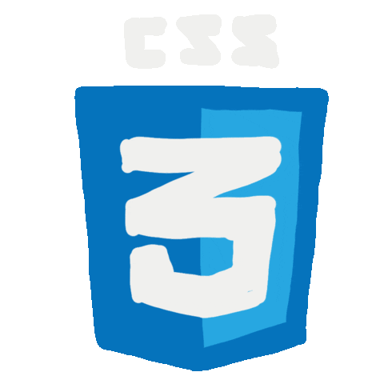
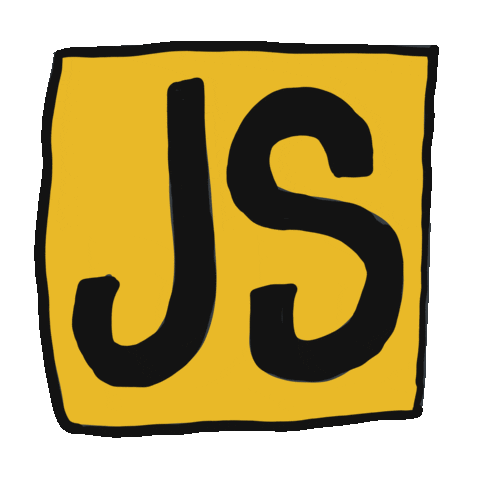

  

  

  

## 🔎 About Me:

  

- 🌐 Web:
  
  
  
  
  
- 💻 Programming Languages:
  
  
  
- 🏗️ Frameworks:
  
  
  
  
- 🗄️ Databases:
  
  
  
  
- 🔧 Dev Tools:
  
  
  
  
- 📬 How to reach me:
  
  
  
- 📢 Languages: 🇺🇸 English | 🇻🇪 / 🇪🇸 Spanish | 🇯🇵 Japanese (JLPT N4).
- ⚡ Fun fact: I am a  Elite Squad member who loves ramen. 🍜
- 💬 Interests: ✝️ Faith | 💪🏽 Fitness | 📚 Reading | 📈 Day Trading.

## 🛠️ Technologies & Tools:

  
  
  
  
  
  
  
  
  
  
  
  
  
  
  
  
  <!--
  
  
  -->

## ⭐ GitHub Commits & Contributions:

  <picture>
    <source media="(prefers-color-scheme: dark)" srcset="https://raw.githubusercontent.com/ajfm88/ajfm88/output/pacman-contribution-graph-dark.svg">
    <source media="(prefers-color-scheme: light)" srcset="https://raw.githubusercontent.com/ajfm88/ajfm88/output/pacman-contribution-graph.svg">
    
  </picture>

<!--  -->

## 🎯 Professional Objective:

  

##  Let's Stay Connected:

