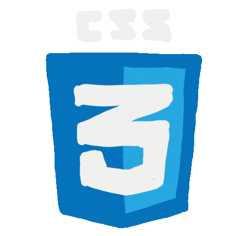
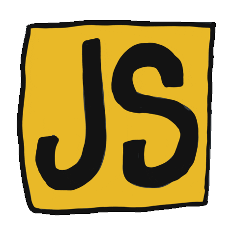

  

  

  

## 🔎 About Me:

I started coding in college in , where I also took a database class using . I then went onto work as a coding instructor teaching  and basic ,  and  to school-age children from Elementary, Middle and High School.

After a year of self-learning, I was able to land a job as a Junior Software Developer where I went deep in , , , , , ,  and .

I also took the time to keep learning on my own and build portfolio pieces using , , ,  and 

Outside of code, I speak 🇺🇸 English, 🇻🇪/🇪🇸 Spanish, and I'm learning 🇯🇵 Japanese (JLPT N4). Fun fact: I'm a  Elite Squad member who loves a good bowl of ramen 🍜. When I'm not coding, you'll find me focused on ✝️ my faith, 💪🏽 staying active, 📚 reading, or 📈 keeping an eye on the markets.

## 🛠️ Technologies & Tools:

  
  
  
  
  
  
  
  
  
  
  
  
  
  
  
  
  <!--
  
  
  -->

## ⭐ GitHub Commits & Contributions:

  <a href="https://pac-man-ajfm88.netlify.app">
    <picture>
      <source media="(prefers-color-scheme: dark)" srcset="https://raw.githubusercontent.com/ajfm88/ajfm88/output/pacman-contribution-graph-dark.svg">
      <source media="(prefers-color-scheme: light)" srcset="https://raw.githubusercontent.com/ajfm88/ajfm88/output/pacman-contribution-graph.svg">
      
    </picture>
    </a>

<!--  -->

## 🎯 Professional Objective:

  

##  Let's Stay Connected:

